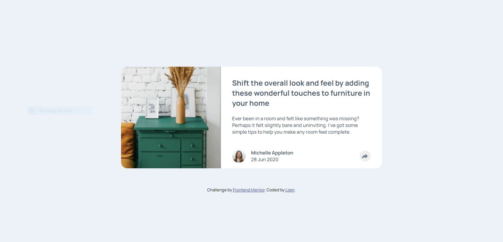

# Frontend Mentor - Article preview component solution

This is a solution to the [Article preview component challenge on Frontend Mentor](https://www.frontendmentor.io/challenges/article-preview-component-dYBN_pYFT). Frontend Mentor challenges help you improve your coding skills by building realistic projects. 

## Table of contents

- [Overview](#overview)
  - [The challenge](#the-challenge)
  - [Screenshot](#screenshot)
  - [Links](#links)
- [My process](#my-process)
  - [Built with](#built-with)
  - [Useful resources](#useful-resources)
- [Author](#author)

## Overview

### The challenge

Users should be able to:

- View the optimal layout for the component depending on their device's screen size
- See the social media share links when they click the share icon

### Screenshot

### Links

- Solution URL: [Frontend Mentor](https://www.frontendmentor.io/solutions/article-preview-with-responsive-design-36NJP0mXc)
- Live Site URL: [Vercel](https://article-preview-component-master-eight-delta.vercel.app/)

## My process

### Built with

- Semantic HTML5 markup
- CSS custom properties
- [JavaScript](https://www.javascript.com/) - JavaScript

### Useful resources

- [How To Create Popups](https://www.w3schools.com/howto/howto_js_popup.asp)
- [Customizing Icons](https://fontawesome.com/v6.0/docs/web/style/custom)

## Author

- Frontend Mentor - [@Liam](https://www.frontendmentor.io/profile/liam-99)
